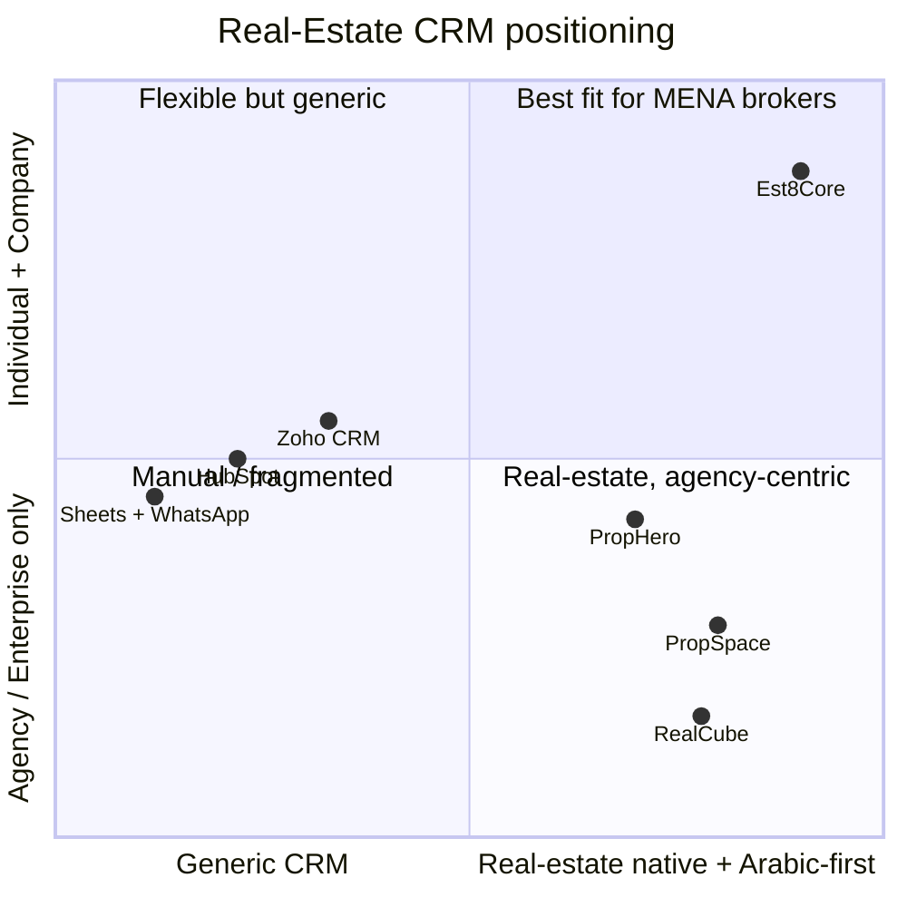

<div align="center">


<br/><br/>

# The Operating System for Real‑Estate Brokerage

#### From the first lead to the closed commission — one platform for brokerage companies **and** individual brokers.

<br/>

[](https://est8core.github.io)
&nbsp;
[](./README.ar.md)
&nbsp;
[](#-partnership--early-access--contact)


</div>

---

## 🎯 The Problem

Real‑estate brokerages are growth machines run on tools that were never built for them:

| What they use today | Why it hurts |
|---|---|
| 📊 **Spreadsheets + personal WhatsApp** | Leads slip through the cracks · no follow‑up · no reporting · zero management visibility |
| 🧩 **Generic global CRMs** (HubSpot, Zoho…) | Not real‑estate aware · weak Arabic · costly to customize · USD pricing |
| 🏚️ **Some regional systems** | Often **agency/portal‑centric** · individual brokers underserved · limited hierarchy/scoping depth |

**The cost:** leaked leads, untracked commissions, decisions made on gut and memory instead of data.

---

## 💡 What is Est8Core?

**Est8Core** is a **multi‑tenant SaaS** purpose‑built for **real‑estate brokerage** — modeling the actual lifecycle, not a generic pipeline bent to fit:

```
Capture lead  →  Qualify  →  Show property  →  Negotiate  →  Close with commission
```

It's designed around how brokerages *really* operate — **branches, teams, roles, visibility scopes, lead distribution, and commissions** — while staying dead‑simple for the solo broker.

### 👥 Built for two kinds of customer

| 🏢 **Brokerage Company** | 👤 **Individual Broker** |
|---|---|
| Full hierarchy: **Owner → Branch Heads → Team Leaders → Agents** | Simple setup, **no branch/role overhead** |
| Branches · roles · data scoping · lead distribution | Start capturing leads and closing deals on day one |

> **One platform that grows with you** — from a solo broker to a multi‑branch network.

---

## ⚙️ Capabilities

| | Module | What it does |
|---|---|---|
| 🎯 | **Leads** | Sources, stages, **multi‑assignment**, distribution, follow‑ups |
| 👤 | **Contacts** | Unified client record with a full interaction timeline |
| 🏠 | **Properties** | Catalog with media, status & publishing |
| 🤝 | **Deals** | Negotiation pipeline, **commissions, installments**, approvals |
| 🏢 | **Branches & Teams** | A real organizational hierarchy |
| 🔐 | **RBAC + Data Scoping** | Each role sees/edits only what's theirs — **company / branch / team / assigned** |
| 💬 | **WhatsApp Inbox** | Talk to clients inside the system · *(roadmap)* |
| 🔔 | **Notifications** | Real‑time, multi‑channel · *(roadmap)* |
| 📤 | **Data I/O** | Import & export — full operability |
| 📊 | **Dashboards · Reports · Targets** | Role‑aware management visibility · *(roadmap)* |

---

## 🆚 Benchmark — where Est8Core stands apart

Regional incumbents are **mature and capable** — Est8Core competes by owning an **underserved combination**: *Arabic‑first, individual **and** company in one platform, WhatsApp‑native, a modern multi‑tenant core, and MENA‑fit pricing.*



| Dimension | Sheets + WhatsApp | Global CRM<br/>(HubSpot / Zoho) | Regional RE CRM<br/>(PropSpace / RealCube) | **Est8Core** |
|---|:---:|:---:|:---:|:---:|
| Real‑estate domain model | ⬜ | 🟡 *heavy customization* | ✅ | ✅ |
| **Arabic‑first / RTL** | 🟡 *manual* | 🟡 *partial* | 🟡 *varies* | ✅ **native** |
| **Individual broker + company in one** | ⬜ | 🟡 | 🟡 *agency‑centric* | ✅ **both** |
| Brokerage hierarchy + data scoping | ⬜ | 🟡 *enterprise tiers* | 🟡 *varies* | ✅ **granular** |
| Commissions + installments | ⬜ | ⬜ *manual* | 🟡 *varies* | ✅ |
| **WhatsApp‑native inbox** | 🟡 *personal app* | 🟡 *add‑on* | 🟡 *varies* | ✅ *(roadmap)* |
| Multi‑tenant isolation (schema‑per‑tenant) | — | ✅ *(their cloud)* | 🟡 *varies* | ✅ |
| MENA‑fit, accessible pricing | — | 🟡 *USD, global* | 🟡 *~AED 365–5,500/mo* | ✅ *(roadmap)* |

<sub>Legend: ✅ native focus · 🟡 partial / varies · ⬜ not designed for it · — n/a. Directional, category‑level comparison — capabilities differ across products and evolve; a ✅ reflects Est8Core's design focus, with some items in Early Access / on the roadmap. Competitor names belong to their owners; this is positioning, not a feature audit.</sub>

---

## 🏗️ Architecture & Security

- **Multi‑tenant with schema‑per‑tenant isolation** on PostgreSQL — every customer's data is truly isolated.
- **Security‑first:** JWT auth · Argon2id password hashing · TOTP 2FA · an **RBAC authorization layer enforced on every route**.
- **Modern modular‑monolith** core — fast to evolve, ready to scale.

---

## 🗺️ Roadmap

| Stage | Scope |
|---|---|
| ✅ **Foundation & Security** | Multi‑tenancy · RBAC + hierarchy/teams/scoping · auth hardening |
| 🚧 **CRM Depth** | Lead assignment/distribution · deal commissions & installments · unified client record |
| 🔜 **Communication** | WhatsApp inbox · real‑time notifications · import/export |
| 🔜 **Platform** | Dashboards · targets · reports · portals · billing |
| 🤖 **AI Horizon** | **Smart lead scoring & prioritization · intelligent auto‑distribution · AI WhatsApp assistant (draft replies / summarize) · predictive deal forecasting · property↔client matching · natural‑language reports & search** |

---

## ▶️ Live Demo

Try an early interactive preview of the product — no signup:

<div align="center">

[](https://est8core.github.io)

</div>

> *The demo is a front‑end preview of the experience; data is illustrative.*

---

<div align="center" id="-partnership--early-access--contact">

## 🤝 Partnership · Early Access · Contact

We're in **Early Access** and welcome **partners, brokerages for early onboarding, investors, and developers**.

<br/>

[](mailto:info@futuresolutionsdev.com)
[](https://wa.me/201148371185)
[](https://www.linkedin.com/company/futuresolutionsdev)
[](https://www.facebook.com/futuresolutionsdev)

📧 **info@futuresolutionsdev.com** · 💬 **WhatsApp** [+20 114 837 1185](https://wa.me/201148371185) · 📞 [+20 101 547 1713](tel:201015471713)

<br/>

> 💡 **Interested in a partnership or early access?** Email or WhatsApp us — we'd love to talk.

<br/>

<sub>🏢 A product by <b>Future Solutions Dev</b></sub><br/>
<sub>© Est8Core — Real‑Estate Brokerage CRM · Built for MENA 🌍 · Early Access</sub>

</div>
