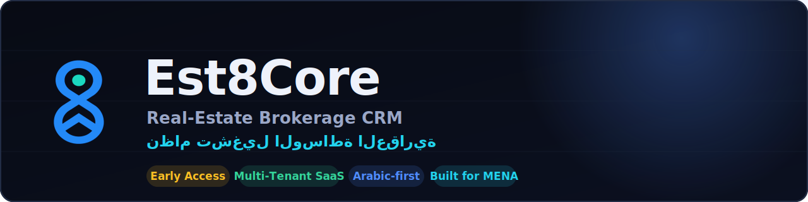

  

# One platform to run your entire brokerage.

#### Leads · properties · deals · commissions · teams — unified. Built **Arabic‑first** for MENA, for **brokerage companies _and_ individual brokers**.

> **Stop juggling WhatsApp, spreadsheets, property portals, and half‑a‑dozen disconnected tools.**
> Est8Core brings it all into **one source of truth** — *we save you all of that.*

 

&nbsp;

&nbsp;

---

## ❌ The Problem — a brokerage running on a patchwork

A real‑estate office is a fast machine for capturing leads and closing deals. Yet almost every brokerage runs on a **patchwork of tools that were never built to work together** — and the cracks between them is exactly where money leaks out.

| The pain you live every day | What it actually costs you |
|---|---|
| 📥 Leads land on **WhatsApp, Facebook, property portals, and walk‑ins** — then scatter across phones and notebooks | Leads forgotten, never followed up, lost to whoever responds first |
| 🧩 Clients in one app, properties in another, **commissions in a spreadsheet**, documents in a drive | No single source of truth · constant **double data‑entry** · errors |
| 🔁 You juggle **5–7 disconnected tools** that don't talk to each other | Hours wasted copying data · context lost in the gaps |
| 🌍 Most "solutions" are **English‑only, agency‑only, or enterprise‑priced** | The MENA broker — *especially the individual* — is left underserved |
| 👁️ No real view of **branch / team / agent** performance | Decisions made on gut and memory, not data |
| 💸 Commissions & installments tracked **by hand** | Disputes, missed payments, leaked revenue |

> **The bottom line:** lost leads, untracked commissions, blind management, and your team spending more time *feeding tools* than *closing deals*.

---

## ✅ The Solution — one platform, one source of truth

**Est8Core replaces the entire fragmented stack with a single platform**, modeled on how brokerages *actually* operate — and built **Arabic‑first** for the MENA market.

| The pain | How Est8Core solves it |
|---|---|
| Leads scattered across channels | 🎯 **One lead pipeline** — every source, every lead, with assignment, distribution & follow‑ups. Nothing slips. |
| Data spread across disconnected apps | 🔗 **Everything connected** — clients, properties, deals, commissions live in one system, in sync. |
| Juggling many tools + double entry | 🧰 **All‑in‑one** — one login, one source of truth. *We save you all of that.* |
| English‑only / agency‑only / pricey | 🌍 **Arabic‑first**, for **company _and_ individual broker**, MENA‑fit pricing. |
| No team/branch visibility | 🏢 **Real hierarchy** (branches · teams · roles) with **data scoping** — each person sees exactly what's theirs. |
| Commissions by hand | 🤝 **Native deals** with commissions, installments & approvals. |

### 🔁 6+ tools → **1 platform**

---

## 🆚 Benchmark — replace your whole stack

Most brokerages don't compare *one CRM vs another* — they compare **"the pile of tools I use now" vs "one platform."** Here's what Est8Core consolidates:

| The job to be done | Typically done today with… | **Est8Core** |
|---|---|:---:|
| Capture leads (WhatsApp · portals · FB) | WhatsApp + portal inbox + notebook | ✅ Unified **Leads** |
| Client database & history | Excel / a contacts app | ✅ **Contacts** + timeline |
| Property listings | Portal + spreadsheet | ✅ **Properties** |
| Deals, commissions & installments | Spreadsheets | ✅ **Deals** (commission/installments) |
| Branch / team / role management | Nothing, or a generic CRM | ✅ **Branches & Teams** + scoping |
| Client communication | Personal WhatsApp | ✅ **WhatsApp inbox** *(roadmap)* |
| Reports & targets | Manual, end‑of‑month | ✅ **Dashboards** *(roadmap)* |

> **From 6+ disconnected tools to a single, connected platform.**

### …and vs other CRMs

Regional incumbents are **mature and capable** — Est8Core competes by owning the **underserved combination**: *Arabic‑first · individual **and** company · truly all‑in‑one · MENA‑fit pricing.*

| | Generic CRM (HubSpot · Zoho) | Regional RE CRM (PropSpace · RealCube) | **Est8Core** |
|---|:---:|:---:|:---:|
| Real‑estate native | 🟡 heavy setup | ✅ | ✅ |
| **Arabic‑first / RTL** | 🟡 partial | 🟡 often English‑first | ✅ **native** |
| **Individual broker _and_ company** | 🟡 | 🟡 agency‑centric | ✅ **both** |
| **All‑in‑one** (no bolt‑on add‑ons) | 🟡 add‑ons | 🟡 portal‑centric | ✅ |
| Brokerage hierarchy + data scoping | 🟡 enterprise tiers | 🟡 varies | ✅ granular |
| MENA‑fit, accessible pricing | 🟡 USD / global | 🟡 ~AED 365–5,500/mo | ✅ |

Legend: ✅ native focus · 🟡 partial / varies. Directional, category‑level comparison — capabilities differ across products and evolve; a ✅ reflects Est8Core's design focus, with some items in Early Access / on the roadmap. Competitor names belong to their owners; this is positioning, not a feature audit.

---

## 👥 Built for two kinds of customer

| 🏢 **Brokerage Company** | 👤 **Individual Broker** |
|---|---|
| Full hierarchy: **Owner → Branch Heads → Team Leaders → Agents** | Simple setup, **no branch/role overhead** |
| Branches · roles · data scoping · lead distribution | Capture leads and close deals from **day one** |

> **One platform that grows with you** — from a solo broker to a multi‑branch network.

---

## ⚙️ Capabilities

| | Module | What it does |
|---|---|---|
| 🎯 | **Leads** | Sources, stages, **multi‑assignment**, distribution, follow‑ups |
| 👤 | **Contacts** | Unified client record with a full interaction timeline |
| 🏠 | **Properties** | Catalog with media, status & publishing |
| 🤝 | **Deals** | Negotiation pipeline · **commissions, installments**, approvals |
| 💳 | **Billing & Subscriptions** | Multi‑provider payments (**Stripe · Paymob · PayTabs · manual**) · subscriptions · invoices & **e‑invoicing (ETA/ZATCA)** |
| 🏢 | **Branches & Teams** | A real organizational hierarchy |
| 🔐 | **RBAC + Data Scoping** | Each role sees/edits only what's theirs — **company / branch / team / assigned** |
| 👑 | **Platform Admin** | Multi‑tenant control — tenants · plans · billing · **audit log** · platform team & roles |
| 📤 | **Data I/O** | Import & export — full operability |
| 💬 | **WhatsApp Inbox** | Talk to clients inside the system · *(roadmap)* |
| 🔔 | **Notifications** | Real‑time engine (WebSocket) **built** · multi‑channel · *(UI on roadmap)* |
| 📊 | **Dashboards · Reports · Targets** | Role‑aware management visibility · *(roadmap)* |

---

## 🏗️ Architecture & Security

- **Multi‑tenant with schema‑per‑tenant isolation** on PostgreSQL — every customer's data is truly isolated.
- **Security‑first:** JWT auth · Argon2id password hashing · TOTP 2FA · an **RBAC authorization layer enforced on every route**.
- **Modern modular‑monolith** core — fast to evolve, ready to scale.

---

## 🗺️ Roadmap

| Stage | Scope |
|---|---|
| ✅ **Foundation & Security** | Multi‑tenancy (schema‑per‑tenant) · RBAC + hierarchy/teams/scoping · auth hardening |
| ✅ **CRM Core** | Leads (assignment/distribution) · Contacts · Properties · Deals (commissions/installments/approvals) · Import/Export |
| ✅ **Billing & Platform Admin** | Multi‑provider billing · subscriptions · **e‑invoicing** · multi‑tenant admin (tenants · plans · audit · team) |
| 🚧 **Frontend Apps** | Customer‑facing web apps (marketing · CRM · platform admin) on a shared design system — *building now* |
| 🔜 **Communication & Insight** | WhatsApp inbox · notifications UI · dashboards · targets · reports · portals |
| 🤖 **AI Horizon** | **Smart lead scoring & prioritization · intelligent auto‑distribution · AI WhatsApp assistant (draft replies / summarize) · predictive deal forecasting · property↔client matching · natural‑language reports & search** |

---

## ▶️ Live Demo

Try an early interactive preview of the product — no signup:

> *The demo is a front‑end preview of the experience; data is illustrative.*

---

## 🤝 Partnership · Early Access · Contact

We're **pre‑launch — heading into Early Access** and welcome **partners, brokerages for early onboarding, investors, and developers**.

 

📧 **info@futuresolutionsdev.com** · 💬 **WhatsApp** [+20 114 837 1185](https://wa.me/201148371185) · 📞 [+20 101 547 1713](tel:201015471713)

 

> 💡 **Interested in a partnership or early access?** Email or WhatsApp us — we'd love to talk.

 

🏢 A product by <b>Future Solutions Dev</b> 
© Est8Core — Real‑Estate Brokerage CRM · Built for MENA 🌍 · Pre‑launch

